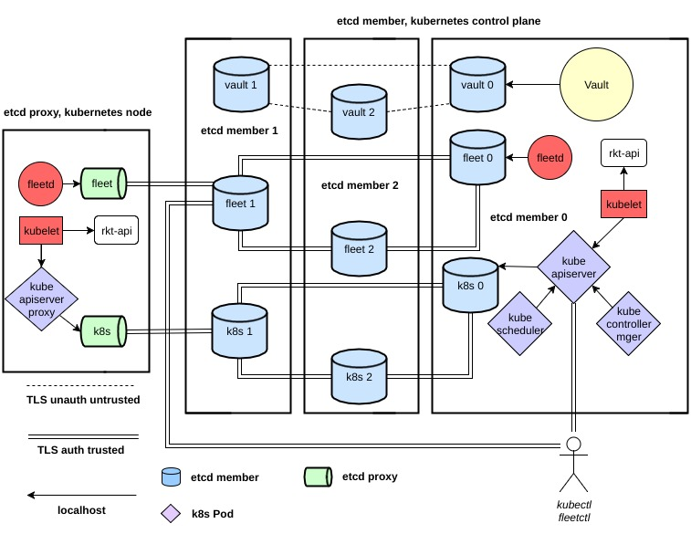
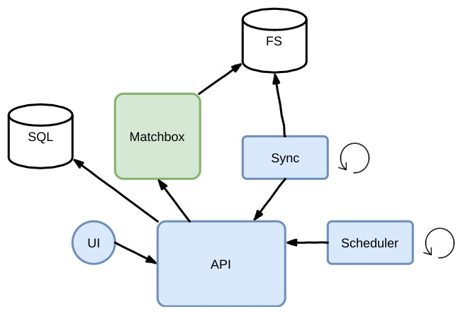
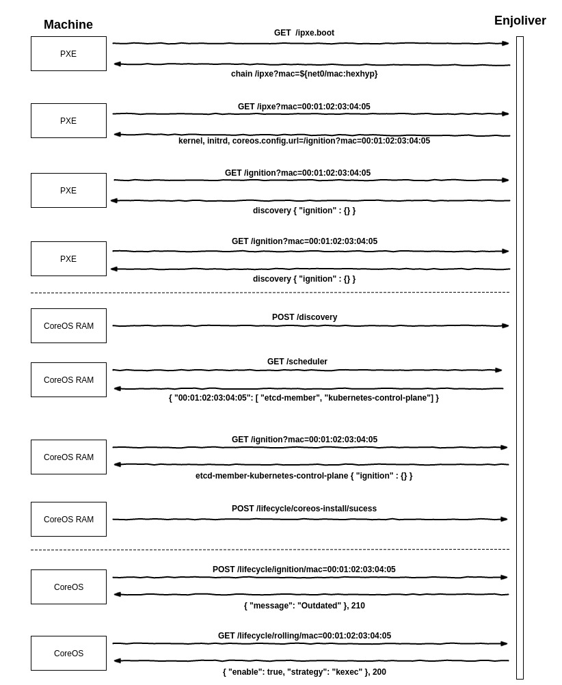
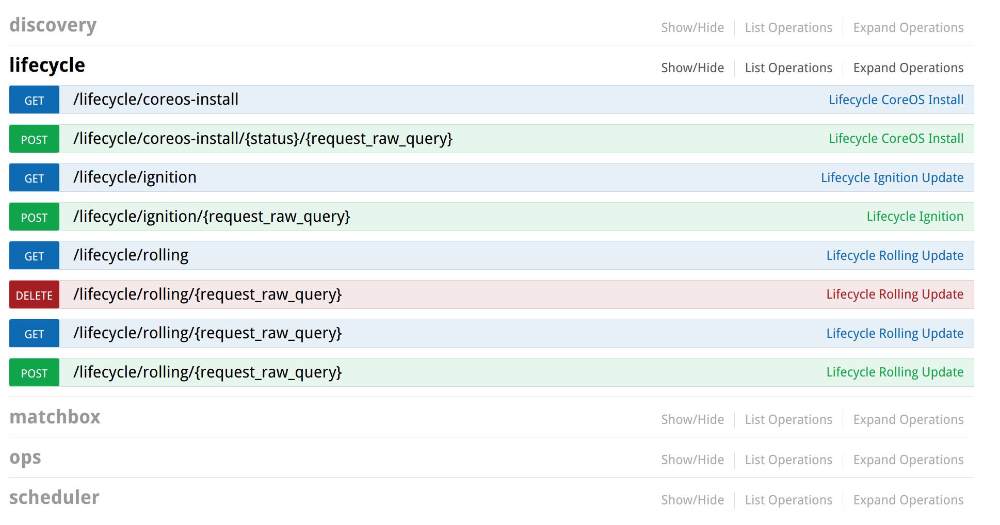
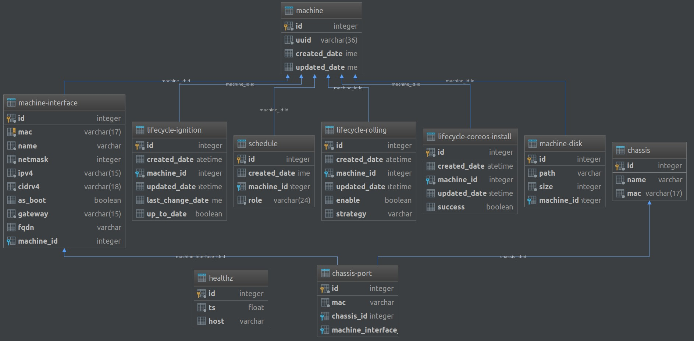

# Enjoliver 

Travis-ci (com / org)

*   
*  
*   
*  

## Description

Deploy and maintain an usable Kubernetes cluster.

The Kubernetes Kubelet container runtime is `rkt`.

During the lifecycle of the Kubernetes cluster, rolling updates are **fast** and fully controlled.
* The rolling update of the configuration changes are granted by Enjoliver API `/lifecycle/rolling/mac=00:01:02:03:04:05`
* The semaphore is managed by locksmith.
* The Ignition is applied after a fast systemd-kexec or normal reboot

Each node can be re-installed and re-join the cluster.

**The project is divided in 4 main topics:**

1) Configuration of Kubernetes cluster roles:
    * control plane
    * node

2) Enjoliver Engine
    * Discovery Topology
    * Scheduling of Kubernetes roles
    * Lifecycle management

3) Enjoliver e2e testing
    * follow any associated releases
    * features, bug fix testing in cluster

4) Kubernetes cluster for development usage, ready to use with sample:
    * Helm / Tiller
    * Heapster
    * Kubernetes Dashboard
    * Kubernetes state metrics
    * Node exporter for Prometheus
    * Prometheus
    * Vault UI
    * CronJobs for etcd3 backups

## 1. Kubernetes Cluster 

Kubernetes controller manager is deployed as *Pod* on each nodes of the control plane.
When the control plane runs the controller, the scheduler starts as a DaemonSet.  

Vault, Kubernetes and Fleet have dedicated etcd clusters.

Vault pki backend secure the following components:

* etcd for fleet - API v2
    * peer
    * client
* etcd for kubernetes - API v3
    * peer
    * client
* kube-apiserver
    * x509 authentication for kubectl  
    * service accounts
* kube-controller-manager
    * cluster signing key
* kubelet

Each etcd cluster supports automatic members replacement.

The configuration of each host is managed by Ignition.

### Current Stack

#### Upstream

* [etcd](https://github.com/coreos/etcd/releases)	
* [cni](https://github.com/containernetworking/cni/releases)
* [rkt](https://github.com/rkt/rkt/releases)
* [kubernetes](https://github.com/kubernetes/kubernetes/releases)
    * PR: ~/aci/aci-hyperkube/patches
* [vault](https://github.com/hashicorp/vault/releases)
* [Container Linux](https://coreos.com/releases)

#### Stick

* [fleet](https://github.com/coreos/fleet/releases/tag/v1.0.0)

## 2. Enjoliver Engine

### Matchbox

[Official project](https://github.com/coreos/matchbox#matchbox)

Enjoliver use 3 profiles in matchbox
1) discovery
2) etcd-member-kubernetes-control-plane
2) kubernetes-node

##### Discovery

The discovery allows to boot in memory CoreOS instances to proceed of:
 
1) sending the facts of the machine (MAC address, IP address, ...)
2) fetch his role
3) disk installation

For matchbox, the discovery profile has one group without any selector.

In this case, all un-selected machines will match this profile by default.
This profile has one associated group, with 2 metadata entries:

1) api uri
2) ssh-key

How the discovery process works:

##### etcd-member-kubernetes-control-plane

This role is for:
1) etcd members
    * vault
    * fleet
    * kubernetes
2) vault
3) kube-{apiserver, controller-manager, scheduler}

This role need to be bootstrapped as 3, 5, ... instances and is needed by all the other nodes.

To solve this problem, the Enjoliver Scheduler will apply the roles only if the required number of instances are available.

So, if the cluster size is 5, the first 5 instances in discovery will get this role.

##### kubernetes-node

This role is a standard worker (Kubernetes node)

All additional nodes over the wanted **etcd-member-kubernetes-control-plane** requirements will become **kubernetes-node**

#### Rolling Update

Each minute, every machine reports the content of `/usr/share/oem/coreos-install.json` to the enjoliver API `lifecycle/ignition/`
Enjoliver will query matchbox and compare the content of the current ignition report and the desired ignition provided by matchbox.
The result will be stored in the database and returned to the machine.

If the state is outdated, the machine will ask its rollingUpdate strategy:
* disable : unset
* kexec
* reboot
* poweroff

If a strategy is returned, the machine try to takes a lock in locksmith and proceed to tear down the machine.
The tear down proceed to drain the kubernetes node. Its disable the scheduling of the node.

When the machine goes back, the ready process starts:
* check etcd-vault
* check etcd-kubernetes
* check etcd-fleet
* check kubernetes cluster trough the local kube-apiserver
* check the kubelet
* check if the node is registered in fleet machines
    * trough local etcd-fleet
    * over remotes etcd-fleet
* uncordon the kubernetes node
* release the lock in locksmith

### Enjoliver API

Everything has to go through this endpoint.

This is the available routes:

    [
      "/", 
      "/apidocs/<path:filename>", 
      "/assets", 
      "/assets/<path:path>", 
      "/backup/db", 
      "/boot.ipxe", 
      "/boot.ipxe.0", 
      "/configs", 
      "/discovery", 
      "/discovery/ignition-journal", 
      "/discovery/ignition-journal/<string:uuid>", 
      "/discovery/ignition-journal/<string:uuid>/<string:boot_id>", 
      "/discovery/interfaces", 
      "/healthz", 
      "/ignition", 
      "/install-authorization/<string:request_raw_query>", 
      "/ipxe", 
      "/lifecycle/coreos-install", 
      "/lifecycle/coreos-install/<string:status>/<string:request_raw_query>", 
      "/lifecycle/ignition", 
      "/lifecycle/ignition/<string:request_raw_query>", 
      "/lifecycle/rolling", 
      "/lifecycle/rolling/<string:request_raw_query>", 
      "/metadata", 
      "/scheduler", 
      "/scheduler/<string:role>", 
      "/scheduler/available", 
      "/scheduler/ip-list/<string:role>", 
      "/shutdown", 
      "/spec", 
      "/specs", 
      "/static/<path:filename>", 
      "/ui", 
      "/ui/view/machine"
    ]

A Swagger UI is available at `/apidocs/index.html`

The Enjoliver API is backed by a SQL database.

### Sync

Matchbox store his state inside filesystem folders (JSON).

To keep it up-to-date, the sync process query the Enjoliver API `/scheduler/...`

In this current topology, the matchbox state isn't critical and can be regenerated at any time.

### Scheduler

By querying the Enjoliver API `/scheduler/available`, the scheduler can affect discovery instances to a role.

### Production - Baremetal

You can take as example the `aci/aci-enjoliver` to see how the rkt container is built with `dgr`

Fulfill the configuration file `app/configs.yaml`

About the aci, you need pass all the `dgr test` or adapt the ignition files.
 
### Development - Local KVM

This part will soon have a better documentation.

If you still want to try you can follow this steps:

Requirements:

* **Linux** with filesystem overlay for `dgr`
* See `apt.sh` for the needed packages or `sudo make apt`
* See `.travis.yml` as a setup example & unit / integration tests

All in one dev setup:

    sudo MY_USER=julien make dev_setup
    
    
Start an interactive Kubernetes deployment of 2 nodes:

    
    # Start the deployment
    sudo make -C app/tests check_euid_it_plans_enjolivage_disk_2_nodes

The enjoliver API is available on `127.0.0.1:5000`, the user interface is behind the `/ui`

    
At the end of the setup, a kubectl proxy is running on `127.0.0.1:8001`
 
 
    Starting to serve on 127.0.0.1:8001
    #####################################
    mkdir -pv ~/.kube
    cat << EOF >> ~/.kube/config
    apiVersion: v1
    clusters:
    - cluster:
        server: http://127.0.0.1:8001
      name: enjoliver
    contexts:
    - context:
        cluster: enjoliver
        namespace: default
        user: 
      name: e
    current-context: e
    kind: Config
    preferences:
      colors: true
    EOF
    kubectl config use-context e
    #####################################

Connect inside with `ssh`:

    ./app/s.sh